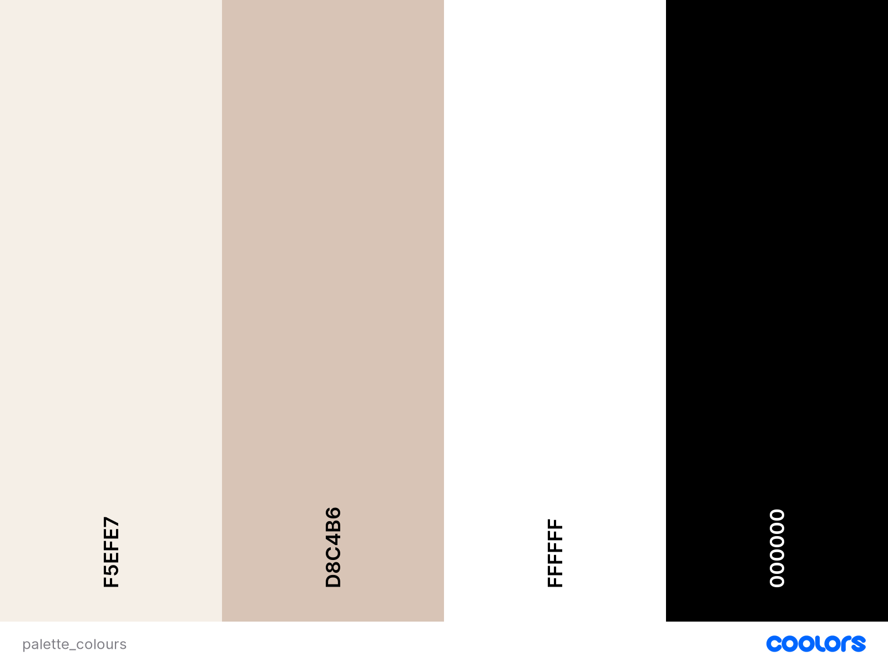
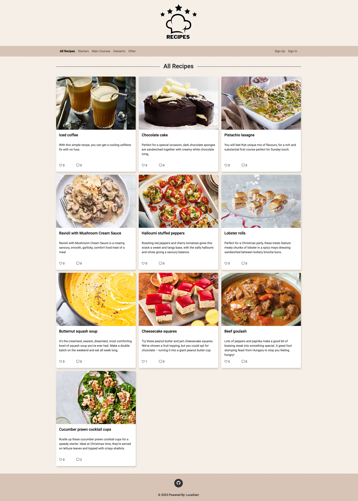

# Five-Star Recipes

Five-Star Recipes is a personal blog with a collection of recipes users can read, like, comment and bookmark. Once a user bookmark a recipe, it will be stored in the user's "favourite" page so he/she can easily find it and read or make it later.

View the repository in GitHub [here](https://github.com/LucaGiarr/five-star-recipes)

View the live project [here](https://five-star-recipes.herokuapp.com/)

## Table of Contents

- [Five-Star Recipes](#five-star-recipes)
  - [User Experience (UX)](#user-experience-ux)
    - [User Stories](#user-stories)
      - [Manage Recipes](#manage-recipes)
      - [Approve comments](#approve-comments)
      - [Create drafts](#create-drafts)
      - [View likes](#view-likes)
      - [View comments](#view-comments)
      - [Leave a comment](#leave-a-comment)
      - [View list of recipes](#view-list-of-recipes)
      - [Open a recipe](#open-a-recipe)
      - [Account registration](#account-registration)
      - [Comment, like and save a recipe](#comment,-like-and-save-a-recipe)
      - [Website navigation](#website-navigation)
    - [Design](#design)
      - [Colour Scheme](#colour-scheme)
      - [Imagery](#imagery)
      - [Fonts](#fonts)
      - [Wireframes](#wireframes)
        - [Desktop](#desktop)
        - [Mobile](#mobile)
  - [Agile Methodology](#agile-methodology)
  - [Data Model](#data-model)
  - [Testing](#testing)
  - [Security Features and Defensive Design](#security-features-and-defensive-design)
    - [User Authentication](#user-authentication)
    - [Form Validation](#form-validation)
    - [Database Security](#database-security)
  - [Features](#features)
    - [Future Features](#future-features)
  - [Deployment - Heroku](#deployment---heroku)
  - [Forking this repository](#forking-this-repository)
  - [Cloning this repository](#cloning-this-repository)
  - [Languages](#languages)
  - [Frameworks - Libraries - Programs Used](#frameworks---libraries---programs-used)
  - [Credits](#credits)
  - [Acknowledgments](#acknowledgments)

---

## User Experience (UX)

Five-Star Recipes is a blog-based app that helps the user to find and try new recipes, comment on them and give feedback to other users and save them for a later date.

### User Stories

#### Manage Recipes

- As a Site User/Site Admin I can create, read, update and delete recipes so that I can manage the content of my recipes.

#### Approve comments

- As a Site Admin I can create approve or disapprove a comment so that I can filter out objectionable comments.

#### Create drafts

- As a Site User/Site Admin I can create draft recipes so that I can finish writing the content later.

#### View likes

- As a Site User/Site Admin I can view the number of likes on each recipe so that I can see which one is the most popular.

#### View comments

- As a Site User/Site Admin I can view the comments on each recipe so that I can read the conversation.

#### Leave a comment

- As a Site User/Site Admin I can leave a comment on a recipe so that I can be involved in the conversation.

#### View list of recipes

- As a Site User I can navigate on all pages of the website so that I can see a list of all recipes.

#### Open a recipe

- As a Site User I can click on a recipe so that I can read the ingredients and method.

#### Account registration

- As a Site User I can register an account so that I can log in and logout.

#### Comment, like and save a recipe

- As a Site User I can log in so that I can comment, like and save a recipe.

#### Website navigation

- As a Site User/Site admin I can view the content of the website so that I can navigate through the website.

---

## Design

### Colour Scheme

Colour palette from Coolors.

The background colour for all pages is "Linen", a grade of creme. It matches the "Dun" used for the navigation bar and the footer. Black and white are used for the text and the boxes in which the text is contained.

In general, the colors used were chosen to transmit calm and give a good contrast between the background and the text at all times.

### Imagery

All images other than the logo will be uploaded by the user.

If the user does not choose an image when creating a recipe (or editing a recipe), a placeholder image will be used.

### Fonts

The Roboto font is used for the whole website to have consistency in the text.

Sans Serif is the backup font, in case the main font isn't imported correctly.

### Wireframes

Wireframes, drawn using Bluebeam, were created for mobile, tablet and desktop.

Wireframes for tablet are the same as per mobile.

#### Desktop

- [All Recipes / Main Courses / Desserts / Other / Personal Recipes / Favourites](docs/wireframes/recipes_all_desk.PNG)
- [All above pages but when the user is logged in](docs/wireframes/recipes_all_desk_user.PNG)
- [Sign In](docs/wireframes/sign_in_desk.PNG)
- [Sign Up](docs/wireframes/sign_up_desk.PNG)
- [My Profile](docs/wireframes/my_profile_desk.PNG)
- [Create a Recipe / Edit a Recipe](docs/wireframes/add_edit_recipe_desk.PNG)

#### Mobile

- [All Recipes / Main Courses / Desserts / Other / Personal Recipes / Favourites](docs/wireframes/recipes_all_mob.PNG)
- [Sign In](docs/wireframes/sign_in_mob.PNG)
- [Sign Up](docs/wireframes/sign_up_mob.PNG)
- [My Profile](docs/wireframes/my_profile_mob.PNG)
- [Create a Recipe / Edit a Recipe](docs/wireframes/add_edit_recipe_mob.PNG)
- [Navigation bar](docs/wireframes/nav_mob.PNG)

## Agile Methodology

Github projects was used in the development process of the project using the agile approach.
Link to project board [here](https://github.com/users/LucaGiarr/projects/2)

## Data Model

I used principles of Object-Oriented Programming throughout this project and Django framework develop the website.

Django AllAuth was used for the user authentication.

In order for the users to create recipes, a custom recipe model was created. It includes multiple attributes which represent a database field. The recipe author is a foreign key to the User model given a recipe can only have one author.

The UserProfile model is created to store all users info and has a relation OneToOne with the user(AllAuth) model. For time constraints, this model will be further developed at a later stage.

The Comment model allows users to comment recipes.

The diagram below details the database schema.

- [Database Schema](docs/readme_images/database_models_schema.PNG)

## Testing

Testing and results can be found [here](/TESTING.md)

## Security Features and Defensive Design

### User Authentication

- Django's user authentication system is used to make sure that a user can sign up, sign in and sign out.

### Form Validation

If incorrect data is added to a form, the form won't submit and a warning will appear to the user informing them what field raised the error.

### Database Security

The database url and secret key are stored in the env.py. This was set up before the first push to Github.

Cross-Site Request Forgery (CSRF) tokens were used on all forms throughout this app.

## Features

The app starts from the "All Recipes" page which is the home page. From this page, the user can navigate to all the other pages present within this app. On top of each page is the logo. When it is clicked, it will open the home page.
In the navigation bar, the user is able to filter the recipes depending on the categories (All Recipes, Starters, Main Courses, Desserts and Other). He/she can also Sign up or Sign In.
The recipes are shown as cards with essential info provided on the pages All Recipes, Starters, Main Courses, Desserts and Other (Personal Recipe and Favourite Recipes when the user is signed in). More detailed info is provided on the recipe details page (one for each recipe) when the recipe's title is clicked on the recipe's card.
A user can Sign up and Sign in. Once he/she signs in, a My Profile page will be created with useful links to change password, create a recipe, to the personal recipe page (which is the page where the recipe created by the user will be stored) and to the favourite recipes page where the saved/bookmarked recipes will be stored.
While a user is signed in, he/she will be able to like, save/bookmark and comment on a recipe (features that are not allowed for a non-signed-in user).
A signed-in user will also be able to create, edit and delete his/her own recipes.
Signed-in users cannot edit and/or delete other's user recipes. If he/she tries to do it, a warning message is displayed.

### Future Features

Future features will include:

- The possibility for the user to add a profile picture and write a description of himself/herself.
- A new page where the user can access to his/her liked recipes.

## Deployment - Heroku

To deploy this page to Heroku from its GitHub repository, the below steps were followed:

### Create the Heroku App

- Log in to [Heroku](https://dashboard.heroku.com/apps) or create an account.
- On the main page click the "New" button in the top right corner and from the drop-down menu select "Create New App".
- Enter an app name.
- Select your region.
- Click on the Create App button.

### Attach the Postgres database

- In the Resources tab, under add-ons, type in Postgres and select the Heroku Postgres option.
- Copy the DATABASE_URL located in Config Vars in the Settings Tab.

### Prepare the environment and settings.py file

- In the GitPod workspace, create an env.py file in the main directory.
- Add the DATABASE_URL value and the chosen SECRET_KEY value to the env.py file.
- Update the settings.py file to import the env.py file and add the SECRETKEY and DATABASE_URL file paths.
- Comment out the default database configuration.
- Save files and make migrations.
- Add Cloudinary URL to env.py
- Add the cloudinary libraries to the list of installed apps.
- Add the STATIC files settings - the url, storage path, directory path, root path, media url and default file storage path.
- Link the file to the templates directory in Heroku.
- Change the templates directory to TEMPLATES_DIR
- Add Heroku to the ALLOWED_HOSTS list the format ['app_name.heroku.com', 'localhost']

### Create files / directories

- Create requirements.txt file
- Create the templates folder in the main directory.
- Create a file named "Procfile" in the main directory and add the following: web: gunicorn project-name.wsgi

### Update Heroku Config Vars

Add the following Config Vars in Heroku:

- SECRET_KEY value
- CLOUDINARY_URL
- PORT = 8000
- DISABLE_COLLECTSTATIC = 1

### Deploy

- NB: Ensure in Django settings, DEBUG is False
- Go to the deploy tab on Heroku and connect to GitHub, then to the required repository.
- Scroll to the bottom of the deploy page and either click Enable Automatic Deploys for automatic deploys or Deploy Branch to deploy manually. Manually deployed branches will need re-deploying each time the repo is updated.
- Once finished Click the Open app button to navigate through the deployed site.

## Forking this repository

- Locate the repository at this link [Five-star Recipes](https://github.com/LucaGiarr/five-star-recipes).
- At the top of the repository, on the right side of the page, select "Fork" from the buttons available.
- A copy of the repository is now created.

## Cloning this repository

To clone this repository follow the below steps:

1. Locate the repository at this link [Five-star Recipes](https://github.com/LucaGiarr/five-star-recipes).
2. Under **'Code'**, see the different cloning options, HTTPS, SSH, and GitHub CLI. Click the prefered cloning option, and then copy the link provided.
3. Open **Terminal**.
4. In Terminal, change the current working directory to the desired location of the cloned directory.
5. Type **'git clone'**, and then paste the URL copied from GitHub earlier.
6. Type **'Enter'** to create the local clone.

## Languages

- Python
- HTML
- CSS
- Javascript

## Frameworks - Libraries - Programs Used

- [Django](https://www.djangoproject.com/): Main python framework used in the development of this project
- [Django-allauth](https://django-allauth.readthedocs.io/en/latest/installation.html): authentication library used to create the user accounts
- [PostgreSQL](https://www.postgresql.org/) was used as the database for this project.
- [Heroku](https://dashboard.heroku.com/login) - was used as the cloud based platform to deploy the site on.
- [Responsinator](http://www.responsinator.com/) - Used to verify responsiveness of website on different devices.
- [Bluebeam](https://www.bluebeam.com/) - Used to generate Wireframe images and to create the database schema design.
- [Chrome Dev Tools](https://developer.chrome.com/docs/devtools/) - Used during the app development, including testing responsiveness and performance.
- [Font Awesome](https://fontawesome.com/) - Used for the icons.
- [GitHub](https://github.com/) - Used for version control and agile tool.
- [Google Fonts](https://fonts.google.com/) - Used to import fonts on the page.
- [W3C](https://www.w3.org/) - Used for HTML & CSS Validation.
- [PEP8 Online](http://pep8online.com/) - used to validate all the Python code.
- [Jshint](https://jshint.com/) - used to validate javascript code.
- [Coolors](https://coolors.co/) - Used to create the colour palette.
- [Summernote](https://summernote.org/): A WYSIWYG editor to allow users to edit their posts.
- [Crispy Forms](https://django-crispy-forms.readthedocs.io/en/latest/) used to manage Django Forms.
- [Cloudinary](https://cloudinary.com/): the image hosting service used to upload images.
- [Bootstrap 4.6](https://getbootstrap.com/docs/4.6/getting-started/introduction/): CSS Framework.

## Credits

- [W3Schools](https://www.w3schools.com/)
- [Django Docs](https://docs.djangoproject.com/en/4.0/)
- [Bootstrap 4.6 Docs](https://getbootstrap.com/docs/4.6/getting-started/introduction/)
- [Stack Overflow](https://stackoverflow.com/)
- [BBC Goodfood](https://www.bbcgoodfood.com/): Some recipes.
- [Tesco Real Food](https://realfood.tesco.com/): Some recipes.
- [Giallo Zafferano](https://www.giallozafferano.it/): Some recipes.
- [Creme de la Crumb](https://www.lecremedelacrumb.com/): Some recipes.
- [Hairbikers](https://www.hairybikers.com/): Some recipes.
- [AutoSlugField](https://django-extensions.readthedocs.io/en/latest/field_extensions.html)
- [Create a user bookmark](https://www.youtube.com/watch?v=H4QPHLmsZMU)
- [Create a user profile page](https://www.youtube.com/watch?v=zb4fIvtn4tY)
- [Code Institute - Blog Walkthrough Project](https://github.com/Code-Institute-Solutions/Django3blog): I reused some of the code present in these lessons.
- Valentina Rainato for the logo.

## Acknowledgments

I would like to acknowledge the following people who helped me along the way in completing my fourth milestone project:

Antonio Rodriguez, my Code Institute Mentor, who gave me suggestions and tips on how to approach this project.
Code Institute, for the lessons (especially the videos related to this project) that were very useful and needful to complete this milestone project.
